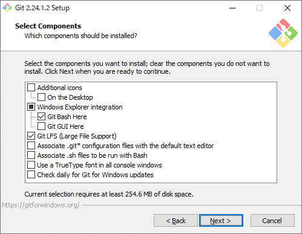

# 1. Git for Windows

## 1.1. インストーラの実行

「Git 2.24.1.2 Setup」ウインドウの「Information」が表示されるので、「Next >」ボタンをクリックする。

「Git 2.24.1.2 Setup」ウインドウの「Select Destination Location」が表示されるので、各項目に以下の値を入力して「Next >」ボタンをクリックする。

| 項番 | 項目                 | 値           |
| :--: | -------------------- | ------------ |
|  1   | Destination Location | C:\opt\git\  |

「Git 2.24.1.2 Setup」ウインドウの「Select Components」が表示されるので、各項目に以下の値を入力して「Next >」ボタンをクリックする。

| 項番 | 項目                                                              | 値                   |
| :--: | ----------------------------------------------------------------- | -------------------- |
|  1   | Additional icons                                                  | チェックをオフにする |
|  2   | On the Desktop                                                    | チェックをオフにする |
|  3   | Windows Explorer integration                                      | チェックをオンにする |
|  4   | Git Bash Here                                                     | チェックをオンにする |
|  5   | Git GUI Here                                                      | チェックをオフにする |
|  6   | Git LFS (Large File Support)                                      | チェックをオンにする |
|  7   | Associate .git\* configuration files with the default text editor | チェックをオフにする |
|  8   | Associate .sh files to be run with Bash                           | チェックをオフにする |
|  9   | Use a TrueType font in all console windows                        | チェックをオフにする |
|  10  | Check daily for Git for Windows updates                           | チェックをオフにする |

「Git 2.24.1.2 Setup」ウインドウの「Select Start Menu Folder」が表示されるので、「Next >」ボタンをクリックする。

「Git 2.24.1.2 Setup」ウインドウの「Choosing the default editor used by Git」が表示されるので、「Next >」ボタンをクリックする。

「Git 2.24.1.2 Setup」ウインドウの「Adjusting your PATH environment」が表示されるので、「Next >」ボタンをクリックする。

「Git 2.24.1.2 Setup」ウインドウの「Choosing HTTPS transport backend」が表示されるので、「Next >」ボタンをクリックする。

「Git 2.24.1.2 Setup」ウインドウの「Configuration the line ending conversion」が表示されるので、各項目に以下の値を入力して「Next >」ボタンをクリックする。

| 項番 | 項目                   | 値                                                     |
| :--: | ---------------------- | ------------------------------------------------------ |
|  1   | Line Ending Conversion | 「Checkout as-is, commit as-is」のチェックをオンにする |

「Git 2.24.1.2 Setup」ウインドウの「Choosing the terminal emulator to user with Git Bash」が表示されるので、「Next >」ボタンをクリックする。

「Git 2.24.1.2 Setup」ウインドウの「Configuration extra options」が表示されるので、「Next >」ボタンをクリックする。

「Git 2.24.1.2 Setup」ウインドウの「Configuration experimental options」が表示されるので、「Next >」ボタンをクリックする。

「Git 2.24.1.2 Setup」ウインドウの「Completing the Git Setup Wizard」が表示されるので、各項目に以下の値を入力して「Finish」ボタンをクリックする。

| 項番 | 項目               | 値                   |
| :--: | ------------------ | -------------------- |
|  1   | Launch Git Bash    | チェックをオフにする |
|  2   | View Release Notes | チェックをオフにする |
