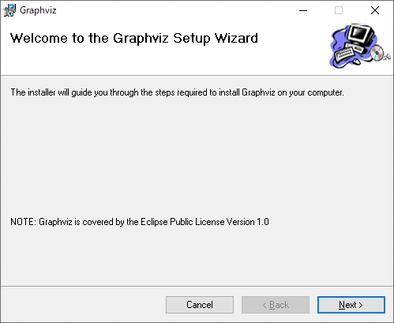
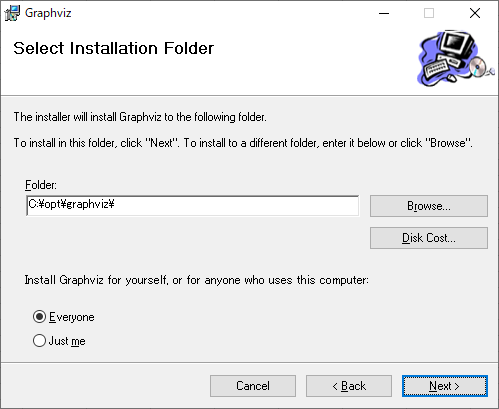
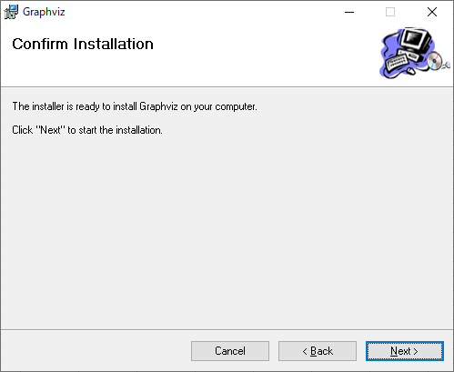
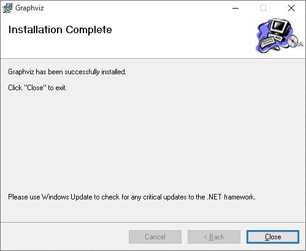

# 1. Graphviz

## 1.1. インストーラの実行

「Graphviz」ウインドウの「Welcome to the Graphviz Setup Wizard」が表示されるので、「Next >」ボタンをクリックする。

「Graphviz」ウインドウの「Select Installation Folder」が表示されるので、各項目に以下の値を入力して「Next >」ボタンをクリックする。

| 項番 | 項目                                                                | 値                                 |
| :--: | ------------------------------------------------------------------- | ---------------------------------- |
|  1   | Folder                                                              | C:\opt\graphviz\                   |
|  2   | Install Graphviz for yourself, or for anyone who uses this computer | 「Everyone」のチェックをオンにする |

「Graphviz」ウインドウの「Confirm Installation」が表示されるので、「Next >」ボタンをクリックする。

「Graphviz」ウインドウの「Installation Complete」が表示されるので、「Close」ボタンをクリックする。

