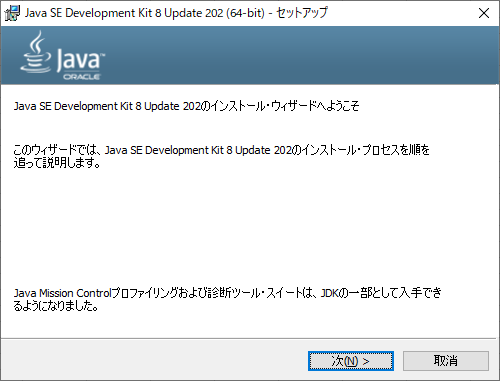
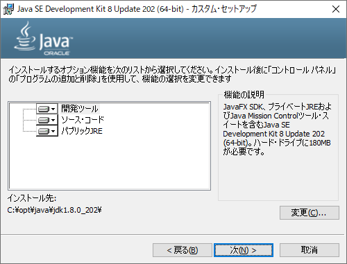
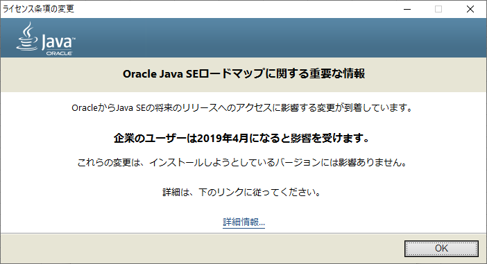
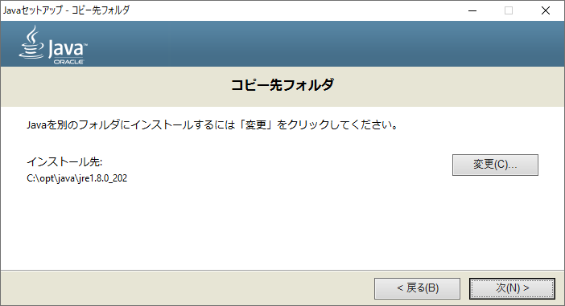
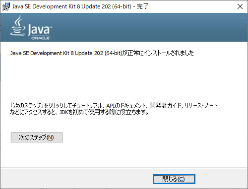
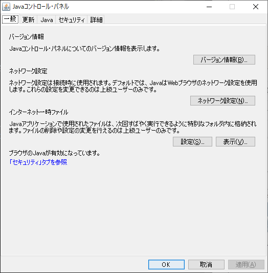
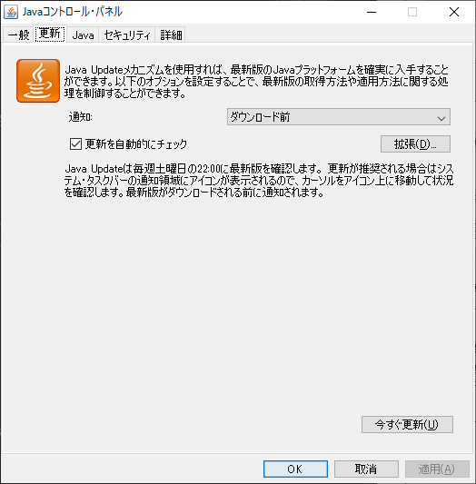
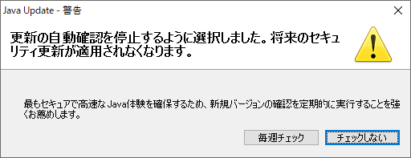
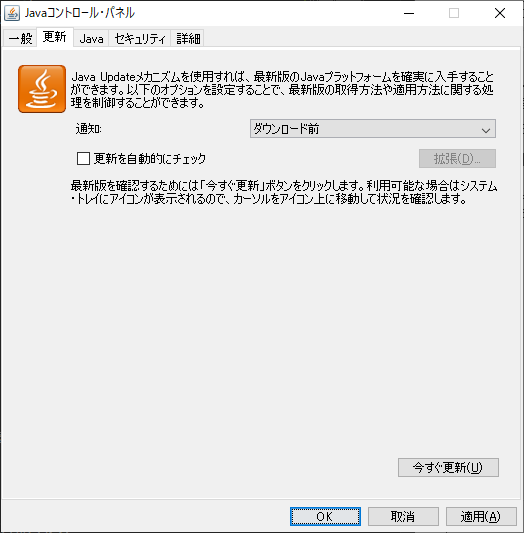

# 1. Oracle Java SE Development Kit 8

## 1.1. ソフトウェアのインストール

「Java SE Development Kit 8 Update 202 (64-bit) - セットアップ」が表示されるので、「次(N) >」ボタンをクリックする。

「Java SE Development Kit 8 Update 202 (64-bit) - カスタム・
セットアップ」が表示されるので、各項目に以下の値を入力して「次(N) >」ボタンをクリックする。

| 項番 | 項目           | 値                         |
| :--: | :------------- | :------------------------- |
|  1   | インストール先 | C:\opt\java\jdk1.8.0_202\  |

「ライセンス条項の変更」が表示されるので、「OK」ボタンをクリックする。

「Java セットアップ - コピー先フォルダ」が表示されるので、各項目に以下の値を入力して「次(N) >」ボタンをクリックする。

| 項番 | 項目           | 値                       |
| :--: | :------------- | :----------------------- |
|  1   | インストール先 | C:\opt\java\jre1.8.0_202 |

「Java SE Development Kit 8 Update 202 (64-bit) - 完了」が表示されるので、「閉じる(C)」ボタンをクリックする。

## 1.2. 更新の自動確認の停止

「スタートボタン」=>「すべてのアプリ」=>「Java」=>「Java の構成」を選択して「Java コントロール・パネル」が表示する。

「Java コントロール・パネル」の「更新」タブをクリックする。

「更新を自動的にチェック」のチェックをオフにすると「Java Update - 警告」が表示されるので、「チェックしない」ボタンをクリックする。

「Java コントロール・パネル」の「OK」ボタンをクリックする。

