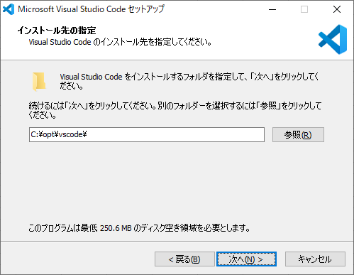

# 1. 目次

<!-- TOC -->

- [1. 目次](#1-%e7%9b%ae%e6%ac%a1)
- [2. ソフトウェアのインストール](#2-%e3%82%bd%e3%83%95%e3%83%88%e3%82%a6%e3%82%a7%e3%82%a2%e3%81%ae%e3%82%a4%e3%83%b3%e3%82%b9%e3%83%88%e3%83%bc%e3%83%ab)
  - [2.1. Visual Studio Code](#21-visual-studio-code)
  - [2.2. ユーザー設定（settings.json）](#22-%e3%83%a6%e3%83%bc%e3%82%b6%e3%83%bc%e8%a8%ad%e5%ae%9asettingsjson)
  - [2.3. 拡張機能](#23-%e6%8b%a1%e5%bc%b5%e6%a9%9f%e8%83%bd)
- [3. 小伝馬町](#3-%e5%b0%8f%e4%bc%9d%e9%a6%ac%e7%94%ba)
  - [3.1. キーボードショートカット コマンド markdown.extension.togglePreviewToSide を削除](#31-%e3%82%ad%e3%83%bc%e3%83%9c%e3%83%bc%e3%83%89%e3%82%b7%e3%83%a7%e3%83%bc%e3%83%88%e3%82%ab%e3%83%83%e3%83%88-%e3%82%b3%e3%83%9e%e3%83%b3%e3%83%89-markdownextensiontogglepreviewtoside-%e3%82%92%e5%89%8a%e9%99%a4)
  - [3.2. html 出力時にサイドバー TOC を有効化](#32-html-%e5%87%ba%e5%8a%9b%e6%99%82%e3%81%ab%e3%82%b5%e3%82%a4%e3%83%89%e3%83%90%e3%83%bc-toc-%e3%82%92%e6%9c%89%e5%8a%b9%e5%8c%96)
  - [3.3. Markdown TOC で日本語がダメぽ問題](#33-markdown-toc-%e3%81%a7%e6%97%a5%e6%9c%ac%e8%aa%9e%e3%81%8c%e3%83%80%e3%83%a1%e3%81%bd%e5%95%8f%e9%a1%8c)

<!-- /TOC -->

# 2. ソフトウェアのインストール

## 2.1. Visual Studio Code

「Microsoft Visual Studio Code セットアップ」の「使用許諾契約書の同意」が表示されるので、「同意する(A)」のチェックをオンにして「次(N) >」ボタンをクリックする。


「Microsoft Visual Studio Code セットアップ」の「インストール先の指定」が表示されるので、各項目に以下の値を入力して「次(N) >」ボタンをクリックする。



| 項番 | 項目           | 値              |
| :--: | :------------- | :-------------- |
|  1   | インストール先 | C:\opt\vscode\  |

「既存のフォルダー」が表示されるので、「はい(Y)」ボタンをクリックする。


「Microsoft Visual Studio Code セットアップ」の「プログラムグループの指定」が表示されるので、「次(N) >」ボタンをクリックする。


「Microsoft Visual Studio Code セットアップ」の「追加タスクの選択」が表示されるので、各項目に以下の値を入力して「次(N) >」ボタンをクリックする。


| 項番 | 項目                                                                                       | 値                   |
| :--: | :----------------------------------------------------------------------------------------- | :------------------- |
|  1   | デスクトップ上にアイコンを作成する(D)                                                      | チェックをオフにする |
|  2   | エクスプローラーのファイル コンテキスト メニューに \[Code を開く] アクションを追加する     | チェックをオンにする |
|  3   | エクスプローラーのディレクトリ コンテキスト メニューに \[Code を開く] アクションを追加する | チェックをオンにする |
|  4   | サポートされているファイルの種類のエディターとして、Code を登録する                        | チェックをオフにする |
|  5   | PATH への追加（再起動後に使用可能）                                                        | チェックをオンにする |

「Microsoft Visual Studio Code セットアップ」の「インストール準備完了」が表示されるので、「インストール(I)」ボタンをクリックする。


「Microsoft Visual Studio Code セットアップ」の「Microsoft Visual Studio Code セットアップウィザードの完了」が表示されるので、「完了(F)」ボタンをクリックする。


## 2.2. ユーザー設定（settings.json）

※2019/12/17 時点

```json
{
  // Editor
  "diffEditor.renderSideBySide": false,
  "editor.colorDecorators": false,
  "editor.detectIndentation": false,
  "editor.fontFamily": "MeiryoKe_Console, Consolas, 'Courier New', monospace",
  "editor.formatOnPaste": true,
  "editor.formatOnSave": true,
  "editor.formatOnType": true,
  "editor.insertSpaces": true,
  "editor.lineNumbers": "on",
  "editor.minimap.renderCharacters": false,
  "editor.minimap.showSlider": "always",
  "editor.multiCursorModifier": "ctrlCmd",
  "editor.renderControlCharacters": true,
  "editor.renderLineHighlight": "all",
  "editor.renderWhitespace": "all",
  "editor.snippetSuggestions": "top",
  "editor.tabSize": 2,
  "editor.wordWrap": "on",
  // Emmet
  "emmet.showSuggestionsAsSnippets": true,
  "emmet.triggerExpansionOnTab": true,
  "emmet.variables": {
    "lang": "ja"
  },
  // Explorer
  "explorer.confirmDelete": false,
  // Files
  "files.associations": {
    ".*lintrc": "json"
  },
  "files.autoGuessEncoding": false,
  "files.encoding": "utf8",
  "files.eol": "\n",
  "files.exclude": {
    "**/*.map": true,
    "**/node_modules": true
  },
  "files.insertFinalNewline": true,
  "files.trimFinalNewlines": true,
  "files.trimTrailingWhitespace": true,
  "[markdown]": {
    "files.trimTrailingWhitespace": false
  },
  // Git
  "git.path": "C:\\opt\\git\\cmd\\git.exe",
  // HTML
  "html.format.contentUnformatted": "pre, code, textarea, title, h1, h2, h3, h4, h5, h6, p",
  "html.format.extraLiners": "",
  "html.format.unformatted": null,
  "html.format.wrapLineLength": 0,
  "search.exclude": {
    "**/tmp": true
  },
  // Markdown
  "markdown.extension.orderedList.autoRenumber": false,
  "markdown.extension.orderedList.marker": "one",
  "markdown.extension.syntax.decorations": false,
  "markdown.extension.tableFormatter.enabled": false,
  "markdown.preview.breaks": true,
  // Markdown Preview Enhanced
  "markdown-preview-enhanced.enableExtendedTableSyntax": true,
  "markdown-preview-enhanced.enableScriptExecution": true,
  "markdown-preview-enhanced.singlePreview": true,
  "markdown-preview-enhanced.previewTheme": "github-light.css",
  // Paste Images
  "pasteImage.defaultName": "${currentFileNameWithoutExt}_YMMDD_HHmmss",
  "pasteImage.insertPattern": "",
  "pasteImage.path": "${currentFileDir}\\img",
  // Window
  "window.openFoldersInNewWindow": "on",
  "window.title": "${activeEditorMedium}${separator}${rootName}",
  // Workbench
  "workbench.editor.labelFormat": "short",
  "workbench.editor.tabSizing": "shrink",
  "workbench.startupEditor": "none"
}
```

## 2.3. 拡張機能

※2019/12/17 時点

| 項番 | 名前                                          | バージョン |
| :--: | :-------------------------------------------- | :--------- |
|  1   | Japanese Language Pack for Visual Studio Code | 1.41.2     |
|  2   | Markdown All in One                           | 2.6.1      |
|  3   | Markdown Checkbox                             | 1.6.0      |
|  4   | Markdown Preview Enhanced                     | 0.5.0      |
|  5   | Markdown TOC                                  | 1.5.6      |
|  6   | markdown-index                                | 0.0.9      |
|  7   | markdownlint                                  | 0.32.0     |
|  8   | Paste Image                                   | 1.0.4      |
|  9   | PlantUML                                      | 2.13.5     |
|  10  | Prettier - Code formatter                     | 3.14.0     |

# 3. 小伝馬町

## 3.1. キーボードショートカット コマンド markdown.extension.togglePreviewToSide を削除

Markdown All in One はプレビュー表示のショートカットをオーバーライドします。

これは、`ctrl+k v` でプレビュー表示のトグル（開く,閉じるの切り替え）を行うためですが、Markdown Preview Enhanced（MPE）と競合するため無効にします。

ちなみに、有効状態だと MPE のプレビューではなく、デフォルトのプレビューが表示されます。

1. VS Code のメインメニューから、ファイル ＞ 基本設定 ＞ キーボードショートカットを開きます。
1. `ctrl+k v` で検索し、コマンド `markdown.extension.togglePreviewToSide` を右クリックしキーバインドを削除します。

## 3.2. html 出力時にサイドバー TOC を有効化

以前はデフォルトで有効でしたが、セキュリティの関係上デフォルトで無効になっています（ver.0.3.5 以降）。

有効にするには、ユーザー設定で`markdown-preview-enhanced.enableScriptExecution`を`true`にします。

有効にすると、html 出力時にサイドバーメニュー（目次）が生成されます。

ちなみにメニューボタンが左下に表示されるのですが、好みでないので左上にカスタマイズしています。

1. ctrl+shift+p を押し、 Markdown Preview Enhanced: Customize Css を開きます
1. 以下を最終行の後に追加

```less
// サイドバーTOCを左上にする
.md-sidebar-toc.md-sidebar-toc {
  padding-top: 40px;
}

#sidebar-toc-btn {
  bottom: unset;
  top: 8px;
}
```

## 3.3. Markdown TOC で日本語がダメぽ問題

結論、Auto Markdown TOC を使おう。

[Atom の markdown-toc でタイトルが日本語の場合に動かない場合の対処 - 山ｐの楽しいお勉強生活](http://yamap55.hatenablog.com/entry/2018/04/21/004258)

[GitHub Tips: Markdown に対して目次を作る方法 · sakura-editor/sakura Wiki · GitHub](https://github.com/sakura-editor/sakura/wiki/GitHub-Tips:-Markdown-%E3%81%AB%E5%AF%BE%E3%81%97%E3%81%A6%E7%9B%AE%E6%AC%A1%E3%82%92%E4%BD%9C%E3%82%8B%E6%96%B9%E6%B3%95)
