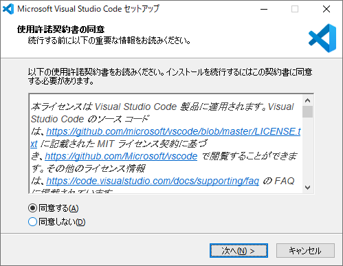
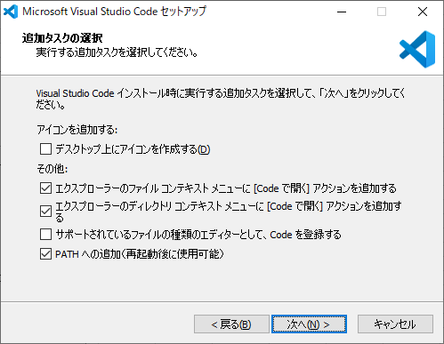
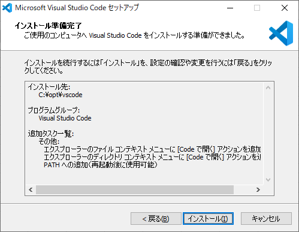
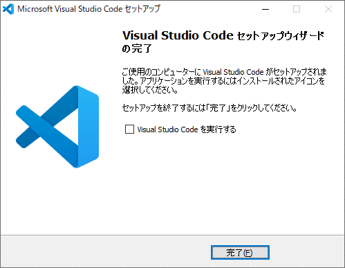

# 1. Visual Studio Code

## 1.1. ソフトウェアのインストール

「Microsoft Visual Studio Code セットアップ」の「使用許諾契約書の同意」が表示されるので、「同意する(A)」のチェックをオンにして「次(N) >」ボタンをクリックする。



「Microsoft Visual Studio Code セットアップ」の「インストール先の指定」が表示されるので、各項目に以下の値を入力して「次(N) >」ボタンをクリックする。


| 項番 | 項目           | 値              |
| :--: | :------------- | :-------------- |
|  1   | インストール先 | C:\opt\vscode\  |

「既存のフォルダー」が表示されるので、「はい(Y)」ボタンをクリックする。


「Microsoft Visual Studio Code セットアップ」の「プログラムグループの指定」が表示されるので、「次(N) >」ボタンをクリックする。


「Microsoft Visual Studio Code セットアップ」の「追加タスクの選択」が表示されるので、各項目に以下の値を入力して「次(N) >」ボタンをクリックする。



| 項番 | 項目                                                                                       | 値                   |
| :--: | :----------------------------------------------------------------------------------------- | :------------------- |
|  1   | デスクトップ上にアイコンを作成する(D)                                                      | チェックをオフにする |
|  2   | エクスプローラーのファイル コンテキスト メニューに \[Code を開く] アクションを追加する     | チェックをオンにする |
|  3   | エクスプローラーのディレクトリ コンテキスト メニューに \[Code を開く] アクションを追加する | チェックをオンにする |
|  4   | サポートされているファイルの種類のエディターとして、Code を登録する                        | チェックをオフにする |
|  5   | PATH への追加（再起動後に使用可能）                                                        | チェックをオンにする |

「Microsoft Visual Studio Code セットアップ」の「インストール準備完了」が表示されるので、「インストール(I)」ボタンをクリックする。



「Microsoft Visual Studio Code セットアップ」の「Microsoft Visual Studio Code セットアップウィザードの完了」が表示されるので、「完了(F)」ボタンをクリックする。



## 1.2. ユーザー設定（settings.json）

※2019/12/17 時点

```json
{
  // Editor
  "diffEditor.renderSideBySide": false,
  "editor.colorDecorators": false,
  "editor.detectIndentation": false,
  "editor.fontFamily": "MeiryoKe_Console, Consolas, 'Courier New', monospace",
  "editor.formatOnPaste": true,
  "editor.formatOnSave": true,
  "editor.formatOnType": true,
  "editor.insertSpaces": true,
  "editor.lineNumbers": "on",
  "editor.minimap.renderCharacters": false,
  "editor.minimap.showSlider": "always",
  "editor.multiCursorModifier": "ctrlCmd",
  "editor.renderControlCharacters": true,
  "editor.renderLineHighlight": "all",
  "editor.renderWhitespace": "all",
  "editor.snippetSuggestions": "top",
  "editor.tabSize": 2,
  "editor.wordWrap": "on",
  // Emmet
  "emmet.showSuggestionsAsSnippets": true,
  "emmet.triggerExpansionOnTab": true,
  "emmet.variables": {
    "lang": "ja"
  },
  // Explorer
  "explorer.confirmDelete": false,
  // Files
  "files.associations": {
    ".*lintrc": "json"
  },
  "files.autoGuessEncoding": false,
  "files.encoding": "utf8",
  "files.eol": "\n",
  "files.exclude": {
    "**/*.map": true,
    "**/node_modules": true
  },
  "files.insertFinalNewline": true,
  "files.trimFinalNewlines": true,
  "files.trimTrailingWhitespace": true,
  "[markdown]": {
    "files.trimTrailingWhitespace": false
  },
  // Git
  "git.path": "C:\\opt\\git\\cmd\\git.exe",
  // HTML
  "html.format.contentUnformatted": "pre, code, textarea, title, h1, h2, h3, h4, h5, h6, p",
  "html.format.extraLiners": "",
  "html.format.unformatted": null,
  "html.format.wrapLineLength": 0,
  "search.exclude": {
    "**/tmp": true
  },
  // Markdown
  "markdown.extension.orderedList.autoRenumber": false,
  "markdown.extension.orderedList.marker": "one",
  "markdown.extension.syntax.decorations": false,
  "markdown.extension.tableFormatter.enabled": false,
  "markdown.preview.breaks": true,
  // Markdown Preview Enhanced
  "markdown-preview-enhanced.enableExtendedTableSyntax": true,
  "markdown-preview-enhanced.enableScriptExecution": true,
  "markdown-preview-enhanced.singlePreview": true,
  "markdown-preview-enhanced.previewTheme": "github-light.css",
  // Paste Images
  "pasteImage.defaultName": "${currentFileNameWithoutExt}_YMMDD_HHmmss",
  "pasteImage.insertPattern": "",
  "pasteImage.path": "${currentFileDir}\\img",
  // Window
  "window.openFoldersInNewWindow": "on",
  "window.title": "${activeEditorMedium}${separator}${rootName}",
  // Workbench
  "workbench.editor.labelFormat": "short",
  "workbench.editor.tabSizing": "shrink",
  "workbench.startupEditor": "none"
}
```

## 1.3. 拡張機能

※2019/12/17 時点

| 項番 | 名前                                          | バージョン |
| :--: | :-------------------------------------------- | :--------- |
|  1   | Japanese Language Pack for Visual Studio Code | 1.41.2     |
|  2   | Markdown All in One                           | 2.6.1      |
|  3   | Markdown Checkbox                             | 1.6.0      |
|  4   | Markdown Preview Enhanced                     | 0.5.0      |
|  5   | Markdown TOC                                  | 1.5.6      |
|  6   | markdown-index                                | 0.0.9      |
|  7   | markdownlint                                  | 0.32.0     |
|  8   | Paste Image                                   | 1.0.4      |
|  9   | PlantUML                                      | 2.13.5     |
|  10  | Prettier - Code formatter                     | 3.14.0     |
